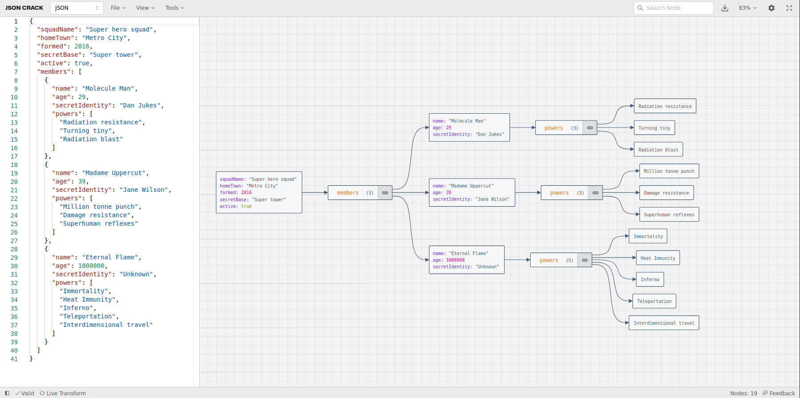

<!--
To README zostało automatycznie wygenerowane przez <https://github.com/YunoHost/apps/tree/master/tools/readme_generator>
Nie powinno być ono edytowane ręcznie.
-->

# JSON Crack dla YunoHost

[](https://ci-apps.yunohost.org/ci/apps/jsoncrack/)


[](https://install-app.yunohost.org/?app=jsoncrack)

*[Przeczytaj plik README w innym języku.](./ALL_README.md)*

> *Ta aplikacja pozwala na szybką i prostą instalację JSON Crack na serwerze YunoHost.*  
> *Jeżeli nie masz YunoHost zapoznaj się z [poradnikiem](https://yunohost.org/install) instalacji.*

## Przegląd

JSON Crack is a tool for visualizing JSON, YAML, CSV, XML, and TOML data in interactive graphs, making files easier to explore, format, and validate. It includes the following features:
- Visualizer: Instantly convert JSON, YAML, CSV, XML, and TOML into interactive graphs or trees in dark or light mode.
- Convert: Seamlessly transform data formats, like JSON to CSV or XML to JSON, for easy sharing.
- Format & Validate: Beautify and validate JSON, YAML, and CSV for clear and accurate data.
- Code Generation: Generate TypeScript interfaces, Golang structs, and JSON Schema.
- JSON Schema: Create JSON Schema, mock data, and validate various data formats.
- Advanced Tools: Decode JWT, randomize data, and run jq or JSON path queries.
- Export Image: Download your visualization as PNG, JPEG, or SVG.
- Privacy: All data processing is performed client-side; nothing is stored on the server.


**Dostarczona wersja:** 2024.12.12~ynh1

**Demo:** <https://jsoncrack.com/editor>

## Zrzuty ekranu



## Dokumentacja i zasoby

- Oficjalna dokumentacja: <https://jsoncrack.com/docs>
- Repozytorium z kodem źródłowym: <https://github.com/AykutSarac/jsoncrack.com>
- Sklep YunoHost: <https://apps.yunohost.org/app/jsoncrack>
- Zgłaszanie błędów: <https://github.com/YunoHost-Apps/jsoncrack_ynh/issues>

## Informacje od twórców

Wyślij swój pull request do [gałęzi `testing`](https://github.com/YunoHost-Apps/jsoncrack_ynh/tree/testing).

Aby wypróbować gałąź `testing` postępuj zgodnie z instrukcjami:

```bash
sudo yunohost app install https://github.com/YunoHost-Apps/jsoncrack_ynh/tree/testing --debug
lub
sudo yunohost app upgrade jsoncrack -u https://github.com/YunoHost-Apps/jsoncrack_ynh/tree/testing --debug
```

**Więcej informacji o tworzeniu paczek aplikacji:** <https://yunohost.org/packaging_apps>
